<h2>TensorFlow-FlexUNet-Image-Segmentation-Melanoma-Skin-Cancer (2026/02/01)</h2>
Sarah T.  Arai 
Software Laboratory antillia.com  
This is the first experiment of Image Segmentation for <b>Melanoma Skin Cancer</b> based on our <a href="./src/TensorFlowFlexUNet.py">TensorFlowFlexUNet</a> 
(TensorFlow Flexible UNet Image Segmentation Model for Multiclass) , 
and <a href="https://www.kaggle.com/datasets/fatemehmehrparvar/skin-cancer-detection/data">
<b>Skin Cancer Detection</b> </a> dataset on the kaggle.com.
  
<b>Data Augmentation Strategy</b> 
To address the limited size of images and masks of the original <b>Melanoma</b> dataset,
we used our offline augmentation tools 
<a href="https://github.com/sarah-antillia/Image-Distortion-Tool">
Image-Distortion-Tool</a> and 
<a href="https://github.com/sarah-antillia/Barrel-Image-Distortion-Tool">
Barrel-Image-Distortion-Tool</a> to generate our Augmented dataset. 
   

<b>Actual Image Segmentation for Melanoma Images  </b> 
As shown below, the inferred masks predicted by our segmentation model trained by the augmented dataset appear similar to the ground truth masks.
 
<b>rgb_map = {melanoma:red,   notmelanoma: green}</b>
  
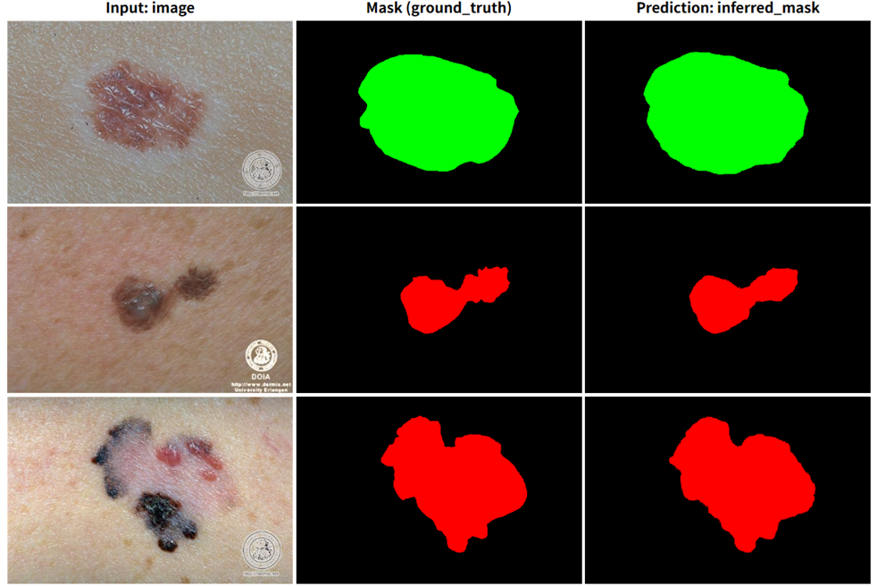
 
<!--
<table>
<tr>
<th>Input: image</th>
<th>Mask (ground_truth)</th>
<th>Prediction: inferred_mask</th>
</tr>
<tr>
<td></td>
<td></td>
<td></td>
</tr>

<tr>
<td></td>
<td></td>
<td></td>
</tr>

<tr>
<td></td>
<td></td>
<td></td>
</tr>
</table>
-->

 
<h3>1  Dataset Citation</h3>
The dataset used here was derived from   
<a href="https://www.kaggle.com/datasets/fatemehmehrparvar/skin-cancer-detection/data">
<b>Skin Cancer Detection</b> </a> on the kaggle.com.
  
For more information, please refer to <a href="https://vip.uwaterloo.ca/skin-cancer-detection/"><b>Skin Cancer Detection</b></a> of  University of Waterloo
  
<b>Description</b> 
Melanoma is considered the most deadly form of skin cancer and is caused by the development of a malignant tumour of the melanocytes.  
The objective of the skin cancer detection project is to develop a framework to analyze 
and assess the risk of melanoma using dermatological photographs taken with a standard consumer-grade camera.
  
<b>About Dataset</b> 
The dataset is maintained by <a href="https://vip.uwaterloo.ca/">VISION AND IMAGE PROCESSING LAB, University of Waterloo</a>.  
The images of the dataset were extracted from the public databases DermIS and DermQuest, along with manual segmentations of the lesions.
  
<b>License</b> 
Please refer to <a href="https://vip.uwaterloo.ca/skin-cancer-detection/"><b>Skin Cancer Detection</b></a>
 
 
<h3>
2 Melanoma ImageMask Dataset
</h3>
 If you would like to train this Melanoma Segmentation model by yourself,
please down load master dataset <a href="https://www.kaggle.com/datasets/fatemehmehrparvar/skin-cancer-detection/data">
<b>Skin Cancer Detection</b> </a> on the kaggle.com.
expand the downloaded , and put it under a working folder. 
We used the following 2 Python scripts to derive our Augmented Melanoma ImageMask Dataset with colorized masks from the master dataset in the working folder. 
<ul>
<li><a href="./generator/ImageMaskDatasetGenerator.py">ImageMaskDatasetGenerator.py</a></li>
<li><a href="./generator/split_master.py">split_master</a></li>
</ul>
<pre>
./dataset
└─Melanoma
    ├─test
    │   ├─images
    │   └─masks
    ├─train
    │   ├─images
    │   └─masks
    └─valid
        ├─images
        └─masks
</pre>
 
<b>Melanoma Statistics</b> 
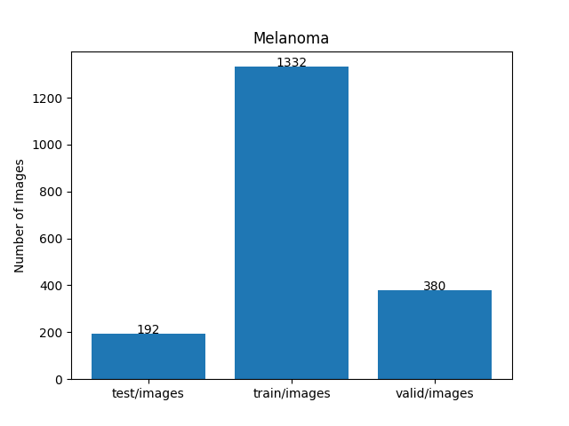 
 
As shown above, the number of images of train and valid datasets is not enough to use for a training set of our segmentation model.
  
<b>You may not redistribute the Augmented Melanoma ImageMask Dataset, and the commercial use of the dataset is prohibited. </b>
  

<b>Train_images_sample</b> 
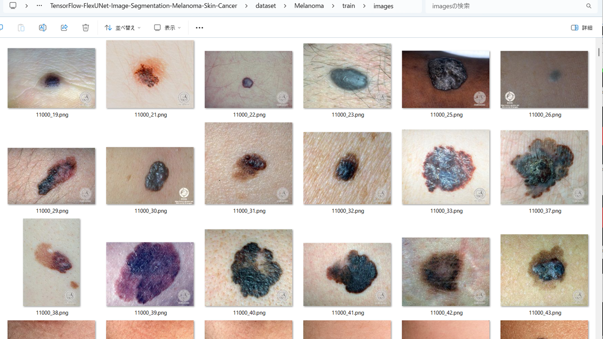
 
<b>Train_masks_sample</b> 
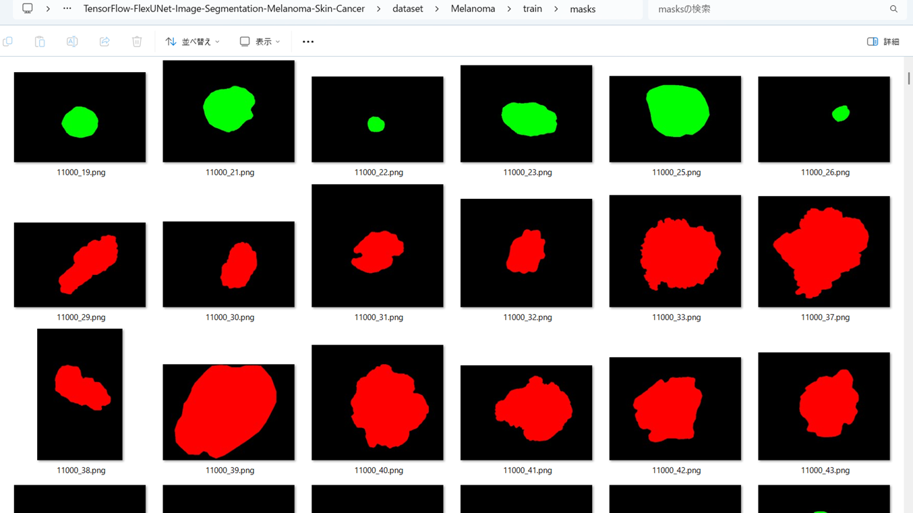
 
<h3>
3 Train TensorflowFlexUNet Model
</h3>
 We trained Melanoma TensorflowFlexUNet Model by using the following
<a href="./projects/TensorFlowFlexUNet/Melanoma/train_eval_infer.config"> <b>train_eval_infer.config</b></a> file.  
Please move to ./projects/TensorFlowFlexUNet/Melanoma and run the following bat file. 
<pre>
>1.train.bat
</pre>
, which simply runs the following command. 
<pre>
>python ../../../src/TensorFlowFlexUNetTrainer.py ./train_eval_infer.config
</pre>

<b>Model parameters</b> 
Defined a small <b>base_filters=16</b> and a large <b>base_kernels=(11,11)</b> for the first Conv Layer of Encoder Block of 
<a href="./src/TensorFlowFlexUNet.py">TensorFlowFlexUNet.py</a> 
and a large num_layers (including a bridge between Encoder and Decoder Blocks).
<pre>
[model]
image_width    = 512
image_height   = 512
image_channels = 3
input_normalize = True
normalization  = False
num_classes    = 3
base_filters   = 16
base_kernels  = (11,11)
num_layers    = 8

dropout_rate   = 0.04
dilation       = (1,1)
</pre>

<b>Learning rate</b> 
Defined a small learning rate.  
<pre>
[model]
learning_rate  = 0.00007
</pre>

<b>Loss and metrics functions</b> 
Specified "categorical_crossentropy" and "dice_coef_multiclass". 
<pre>
[model]
loss           = "categorical_crossentropy"
metrics        = ["dice_coef_multiclass"]
</pre>
<b >Learning rate reducer callback</b> 
Enabled learing_rate_reducer callback, and a small reducer_patience.
<pre> 
[train]
learning_rate_reducer = True
reducer_factor     = 0.5
reducer_patience   = 4
</pre>
<b>Early stopping callback</b> 
Enabled early stopping callback with patience parameter.
<pre>
[train]
patience      = 10
</pre>
<b></b> 
<b>RGB color map</b> 
rgb color map dict for Melanoma 1+2 classes. 
<pre>
[mask]
mask_file_format = ".png"
;Melanoma 1+2
;                   melanoma:red,   notmelanoma: green        
rgb_map = {(0,0,0):0, (255, 0, 0):1, (0, 255, 0):2,}       
</pre>
<b>Epoch change inference callbacks</b> 
Enabled epoch_change_infer callback. 
<pre>
[train]
epoch_change_infer       = True
epoch_change_infer_dir   =  "./epoch_change_infer"
epoch_changeinfer        = False
epoch_changeinfer_dir    = "./epoch_changeinfer"
num_infer_images         = 6
</pre>
By using this epoch_change_infer callback, on every epoch_change, the inference procedure can be called
 for 6 images in <b>mini_test</b> folder. This will help you confirm how the predicted mask changes 
 at each epoch during your training process.    
<b>Epoch_change_inference output at starting (1,2,3)</b> 
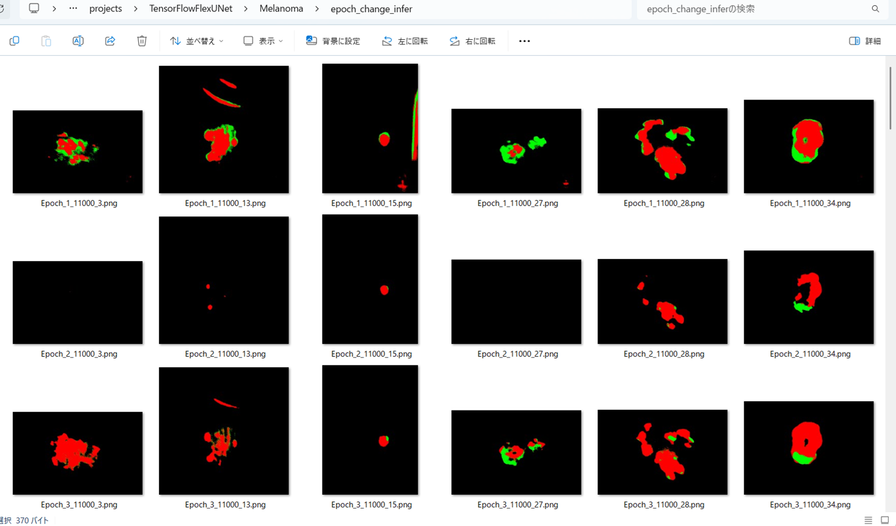 
 
<b>Epoch_change_inference output at ending (28,29,30)</b> 
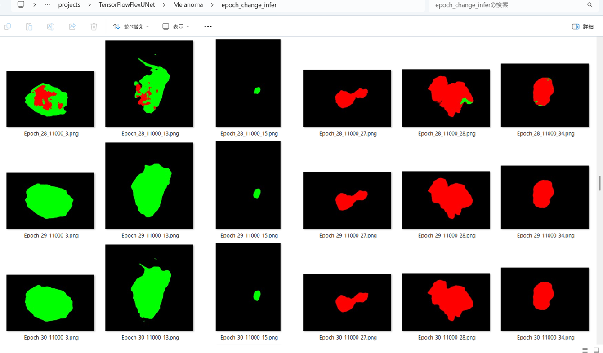 
 
<b>Epoch_change_inference output at ending (58,59,60)</b> 
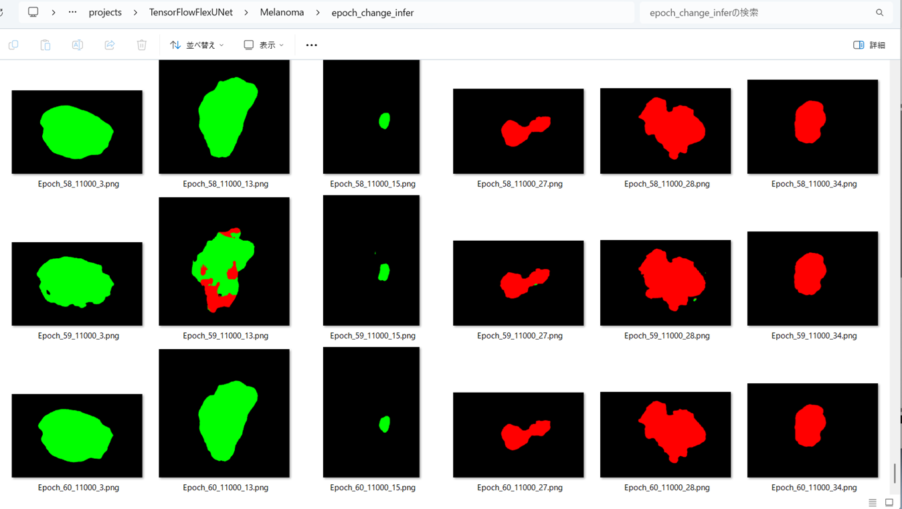 

 
In this experiment, the training process was stopped at epoch 60 by EarlyStoppingCallback.  
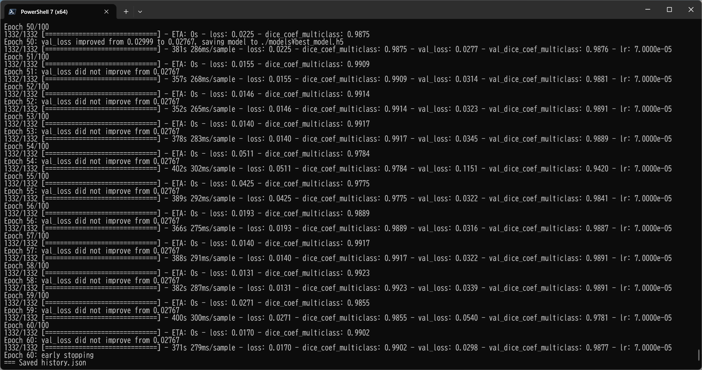 
 
<a href="./projects/TensorFlowFlexUNet/Melanoma/eval/train_metrics.csv">train_metrics.csv</a> 
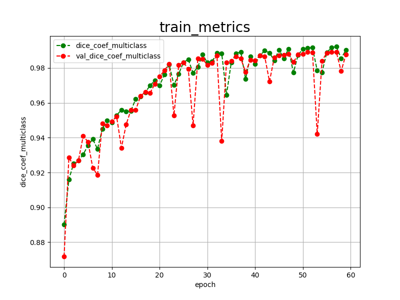 

 
<a href="./projects/TensorFlowFlexUNet/Melanoma/eval/train_losses.csv">train_losses.csv</a> 
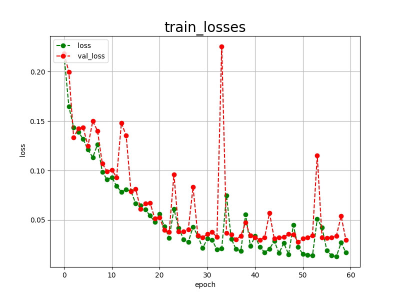 
 
<h3>
4 Evaluation
</h3>
Please move to a <b>./projects/TensorFlowFlexUNet/Melanoma</b> folder, 
and run the following bat file to evaluate TensorflowFlexUNet model for Melanoma. 
<pre>
>./2.evaluate.bat
</pre>
This bat file simply runs the following command.
<pre>
>python ../../../src/TensorFlowFlexUNetEvaluator.py  ./train_eval_infer.config
</pre>
Evaluation console output: 
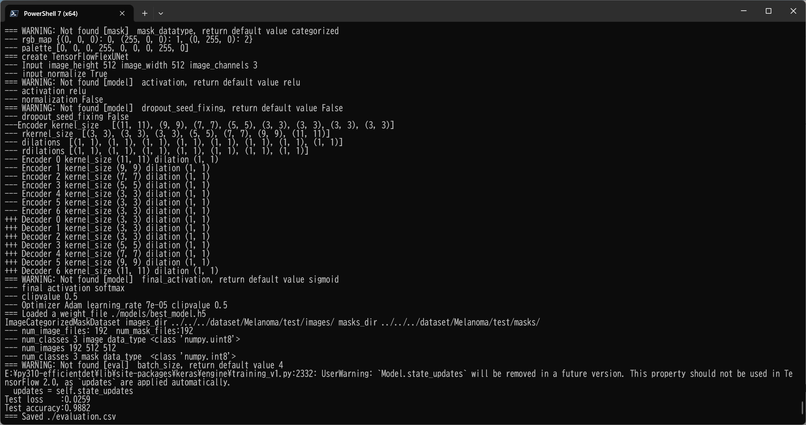
  Image-Segmentation-Melanoma

<a href="./projects/TensorFlowFlexUNet/Melanoma/evaluation.csv">evaluation.csv</a> 
The loss (categorical_crossentropy) to this Melanoma/test was low, and dice_coef_multiclass high as shown below.
 
<pre>
categorical_crossentropy,0.0259
dice_coef_multiclass,0.9882
</pre>
 
<h3>5 Inference</h3>
Please move to a <b>./projects/TensorFlowFlexUNet/Melanoma</b> folder 
,and run the following bat file to infer segmentation regions for images by the Trained-TensorflowFlexUNet model for Melanoma. 
<pre>
>./3.infer.bat
</pre>
This simply runs the following command.
<pre>
>python ../../../src/TensorFlowFlexUNetInferencer.py ./train_eval_infer.config
</pre>

<b>mini_test_images</b> 
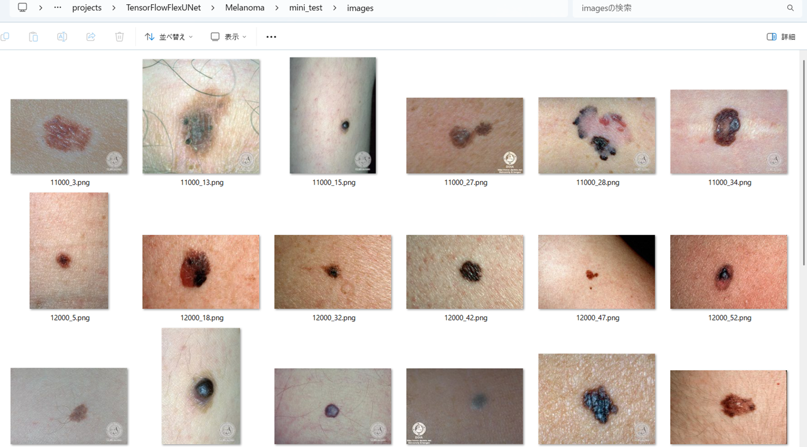 
<b>mini_test_mask(ground_truth)</b> 
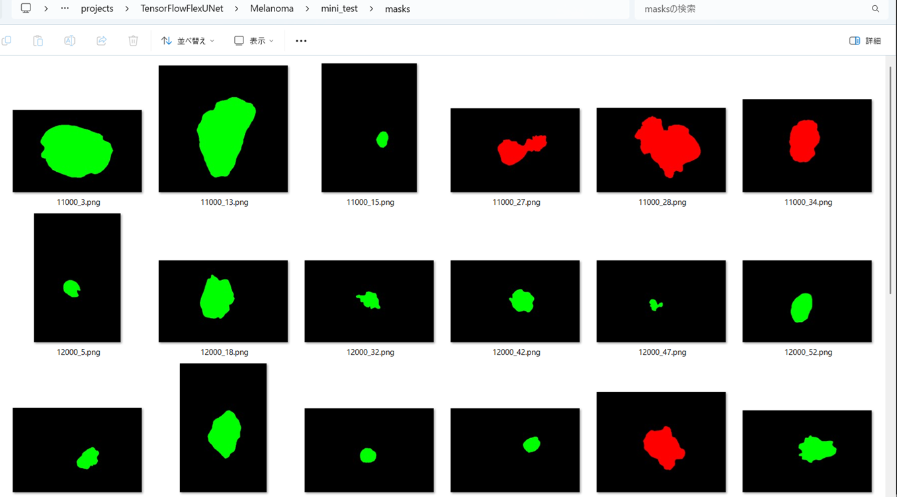 

<b>Inferred test masks</b> 
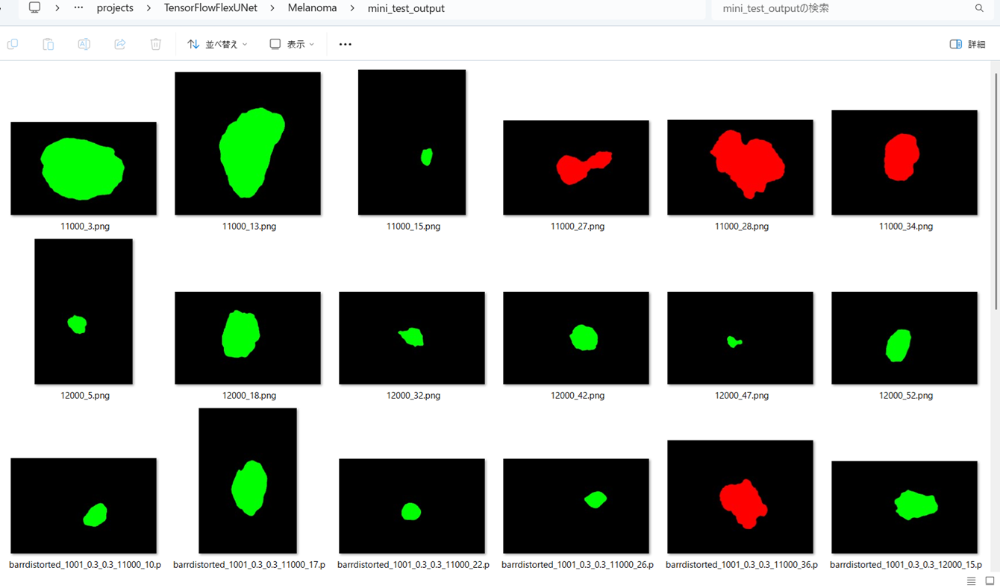 
 

<b>Enlarged images and masks for  Melanoma  Images</b> 
As shown below, the inferred masks predicted by our segmentation model trained by the dataset appear similar to the ground truth masks.
 
<b>rgb_map = {melanoma:red,   notmelanoma: green}</b>
  
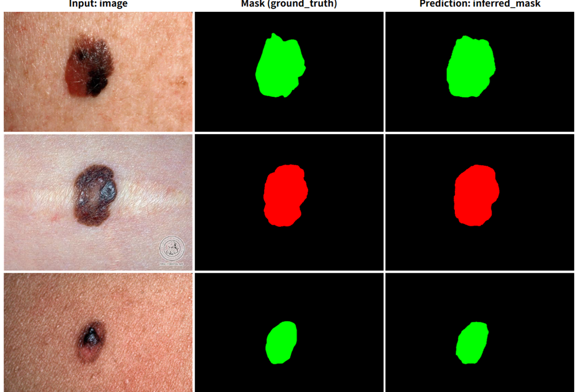
 
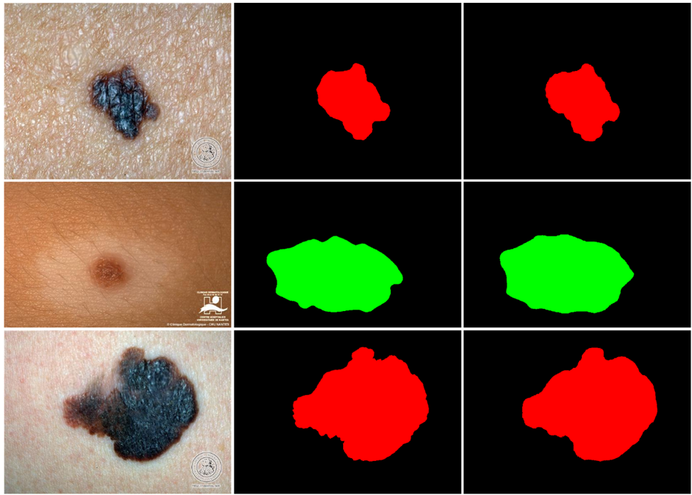

<!--
<table>
<tr>
<th>Input: image</th>
<th>Mask (ground_truth)</th>
<th>Prediction: inferred_mask</th>
</tr>
<tr>
<td></td>
<td></td>
<td></td>
</tr>

<tr>
<td></td>
<td></td>
<td></td>
</tr>

<tr>
<td></td>
<td></td>
<td></td>
</tr>
<tr>
<td></td>
<td></td>
<td></td>
</tr>
<tr>
<td></td>
<td></td>
<td></td>
</tr>
<tr>
<td></td>
<td></td>
<td></td>
</tr>
</table>
-->

 
<h3>
References
</h3>
<b>1. Tensorflow-Tiled-Image-Segmentation-Augmented-Skin-Cancer</b> 
Toshiyuki Arai  
<a href="https://github.com/sarah-antillia/Tensorflow-Tiled-Image-Segmentation-Augmented-Skin-Cancer">
Tensorflow-Tiled-Image-Segmentation-Augmented-Skin-Cancer</a>
 
 
<b>2. TensorFlow-FlexUNet-Image-Segmentation-Model</b> 
Toshiyuki Arai  
<a href="https://github.com/sarah-antillia/TensorFlow-FlexUNet-Image-Segmentation-Skin-Cancer">
TensorFlow-FlexUNet-Image-Segmentation-Skin-Cancer
</a>
 
 
<b>3. TensorFlow-FlexUNet-Image-Segmentation-Model</b> 
Toshiyuki Arai  
<a href="https://github.com/sarah-antillia/TensorFlow-FlexUNet-Image-Segmentation-Model">
TensorFlow-FlexUNet-Image-Segmentation-Model
</a>
 
 
